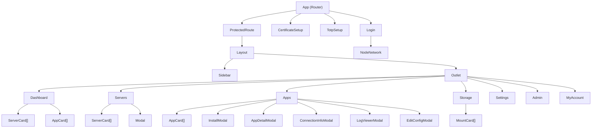
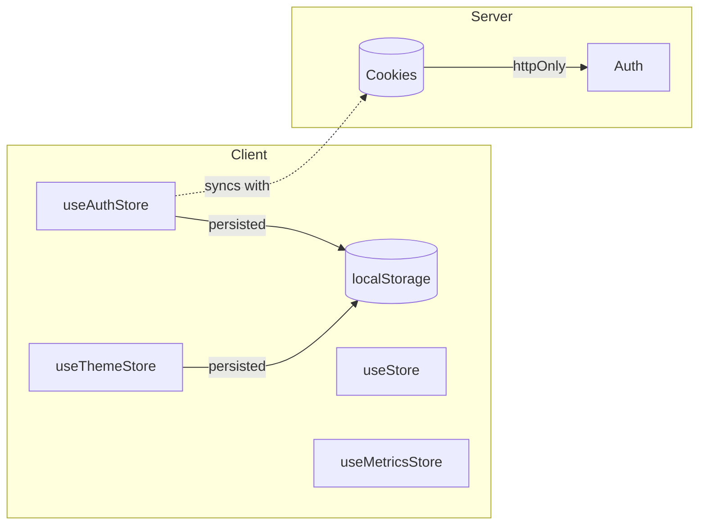
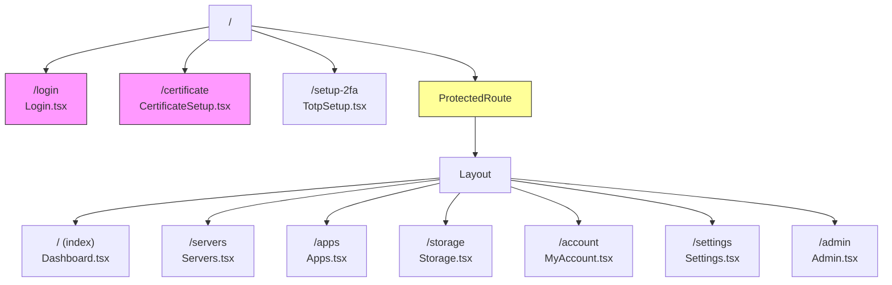
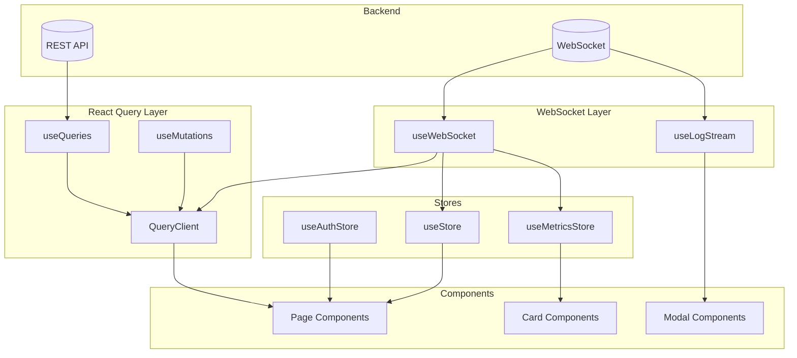

# Ownprem Web UI Architecture

A comprehensive architectural survey of the React frontend (`apps/ui/`).

---

## Table of Contents

1. [Project Structure](#1-project-structure)
2. [Component Architecture](#2-component-architecture)
3. [State Management](#3-state-management)
4. [Routing](#4-routing)
5. [Data Flow](#5-data-flow)
6. [Styling Approach](#6-styling-approach)
7. [Key Dependencies](#7-key-dependencies)
8. [Build/Dev Setup](#8-builddev-setup)
9. [Observations & Flags](#9-observations--flags)

---

## 1. Project Structure

```
apps/ui/
├── src/
│   ├── api/
│   │   └── client.ts              # REST API client with auth/CSRF handling
│   ├── components/                # 20 reusable React components
│   │   ├── Layout.tsx             # Main app layout with sidebar
│   │   ├── ProtectedRoute.tsx     # Route guard for authentication
│   │   ├── Modal.tsx              # Accessible dialog wrapper
│   │   ├── ServerCard.tsx         # Server display card
│   │   ├── AppCard.tsx            # Application display card
│   │   ├── StatusBadge.tsx        # Status display component
│   │   ├── MetricsChart.tsx       # Chart visualizations
│   │   ├── InstallModal.tsx       # App installation flow
│   │   ├── AppDetailModal.tsx     # App info display
│   │   ├── ConnectionInfoModal.tsx# Connection details
│   │   ├── LogViewerModal.tsx     # Real-time log streaming
│   │   ├── EditConfigModal.tsx    # Config editing
│   │   ├── HAConfig.tsx           # High availability config
│   │   ├── NodeNetwork.tsx        # Network visualization
│   │   ├── CaddyRoutesPanel.tsx   # Caddy proxy config
│   │   ├── MountCard.tsx          # Storage mount display
│   │   ├── AppIcon.tsx            # App icon renderer
│   │   └── Toaster.tsx            # Toast notification provider
│   ├── hooks/
│   │   ├── useApi.ts              # React Query wrappers (20+ hooks)
│   │   ├── useWebSocket.ts        # Socket.IO integration
│   │   └── useLogStream.ts        # Log streaming WebSocket
│   ├── pages/
│   │   ├── Dashboard.tsx          # Overview/stats
│   │   ├── Servers.tsx            # Server management
│   │   ├── Apps.tsx               # Application management
│   │   ├── Storage.tsx            # Mount management
│   │   ├── Settings.tsx           # System settings
│   │   ├── Admin.tsx              # Admin panel
│   │   ├── MyAccount.tsx          # User account settings
│   │   ├── Login.tsx              # Auth flow
│   │   ├── TotpSetup.tsx          # 2FA setup
│   │   └── CertificateSetup.tsx   # Cert download
│   ├── stores/
│   │   ├── useAuthStore.ts        # Authentication state
│   │   ├── useStore.ts            # UI state (connection, modals)
│   │   ├── useMetricsStore.ts     # Server metrics history
│   │   └── useThemeStore.ts       # Dark/light theme
│   ├── lib/
│   │   ├── toast.ts               # Sonner toast helpers
│   │   └── validation.ts          # Zod form schemas
│   ├── index.css                  # Tailwind + theme variables
│   ├── main.tsx                   # Entry point
│   └── App.tsx                    # Root router component
├── public/
│   └── icons/                     # App icons (PNG)
├── package.json
├── vite.config.ts
├── tailwind.config.js
├── postcss.config.js
├── tsconfig.json
└── index.html
```

### Organizational Reasoning

| Directory | Purpose | Principle |
|-----------|---------|-----------|
| `api/` | REST client | Centralized API access, single point for auth handling |
| `components/` | Reusable UI | Feature-based components, no nested folders |
| `hooks/` | Custom hooks | Data fetching + WebSocket logic separated from UI |
| `pages/` | Route components | One file per route, maps to URL structure |
| `stores/` | Global state | Domain-specific Zustand stores |
| `lib/` | Utilities | Non-React helpers |

---

## 2. Component Architecture

### Component Hierarchy



### Communication Patterns

| Pattern | Mechanism | Use Case |
|---------|-----------|----------|
| Parent → Child | Props | Data, callbacks, configuration |
| Child → Parent | Callback props | Form submissions, button clicks |
| Cross-component | Zustand stores | Auth state, WebSocket status, theme |
| Async data | React Query cache | Server data, deployments, apps |
| Real-time | WebSocket → cache | Live metrics, deployment status |

### Component Categories

- **Layout**: `Layout`, `ProtectedRoute`, `Modal`
- **Pages**: `Dashboard`, `Servers`, `Apps`, `Storage`, `Settings`, `Admin`, `MyAccount`, `Login`
- **Feature**: `ServerCard`, `AppCard`, `InstallModal`, `LogViewerModal`, `EditConfigModal`
- **Display**: `StatusBadge`, `AppIcon`, `MetricsChart`, `NodeNetwork`, `MountCard`
- **Utility**: `Toaster`

---

## 3. State Management

### Architecture: Zustand with Persist Middleware



### Store Details

#### `useAuthStore` - Authentication
```typescript
interface AuthStore {
  user: User | null;
  isAuthenticated: boolean;
  isLoading: boolean;
  error: string | null;
  totpSetupRequired: boolean;

  // Actions
  setAuthenticated(user: User): void;
  setUser(user: User): void;
  logout(): void;
  setError(error: string): void;
  clearError(): void;
}
```
- **Persisted**: `user`, `isAuthenticated`, `totpSetupRequired`
- **Auth tokens**: Stored in httpOnly cookies (not in store)

#### `useStore` - UI State
```typescript
interface UIStore {
  connected: boolean;              // WebSocket connection
  selectedServerId: string | null;
  installModalOpen: boolean;
  installModalApp: string | null;
}
```
- **Not persisted**: Transient UI state

#### `useMetricsStore` - Metrics History
```typescript
interface MetricsStore {
  history: Record<string, MetricsDataPoint[]>;
  maxDataPoints: number;  // 60 points

  addMetrics(serverId: string, metrics: Metrics): void;
  getServerHistory(serverId: string): MetricsDataPoint[];
}
```
- **In-memory only**: Session data, not persisted

#### `useThemeStore` - Theme
```typescript
interface ThemeStore {
  theme: 'dark' | 'light';
  setTheme(theme: 'dark' | 'light'): void;
  toggleTheme(): void;
}
```
- **Persisted**: User preference
- **Side effect**: Updates `document.documentElement.classList`

---

## 4. Routing

### Router: React Router v7



### Route Guards

1. **`ProtectedRoute`**: Checks `isAuthenticated` from auth store
2. **TOTP Gate**: Redirects to `/setup-2fa` if `totpSetupRequired`
3. **Admin Route**: Only visible to users with `isSystemAdmin: true`

### Navigation

- **Declarative**: `<NavLink>` in sidebar with active state styling
- **Programmatic**: `useNavigate()` for redirects
- **State preservation**: Stores attempted location before login redirect

---

## 5. Data Flow

### Architecture Overview



### REST API Client (`api/client.ts`)

**Features:**
- Base URL: `/api`
- Auth: httpOnly cookies (automatic)
- CSRF: `X-CSRF-Token` header on mutations
- 401 handling: Automatic token refresh with mutex lock
- Error handling: Structured `ApiError` class

### React Query Hooks (`hooks/useApi.ts`)

**Query Hooks (20+):**
```typescript
useServers()              // Polls every 30s
useServer(id)
useApps(includeSystem?)
useApp(name)
useDeployments(serverId?) // Polls every 10s
useDeployment(id)
useSystemStatus()         // Polls every 10s
useMounts()
useServerMounts()         // Polls every 30s
useValidateInstall(serverId, appName)
```

**Mutation Hooks:**
```typescript
useInstallApp()
useStartDeployment()
useStopDeployment()
useRestartDeployment()
useUninstallDeployment()
useCreateMount()
useUpdateMount()
useDeleteMount()
useMountStorage()
useUnmountStorage()
```

### WebSocket Integration (`hooks/useWebSocket.ts`)

**Events Handled:**
| Event | Action |
|-------|--------|
| `connect` | Set `connected: true` |
| `disconnect` | Set `connected: false` |
| `server:status` | Update server in query cache |
| `server:connected` | Update server status |
| `server:disconnected` | Update server status |
| `deployment:status` | Update deployment in cache |
| `command:result` | Show toast notification |

**Optimistic Updates:**
```typescript
socket.on('server:status', (data) => {
  queryClient.setQueryData(['servers'], (old) =>
    old?.map(s => s.id === data.serverId ? {...s, ...data} : s)
  );
});
```

### Log Streaming (`hooks/useLogStream.ts`)

Separate socket connection for deployment logs:
```typescript
socket.emit('subscribe:logs', { deploymentId });
socket.on('deployment:log', ({ line }) => appendLine(line));
```

---

## 6. Styling Approach

### Stack: Tailwind CSS + CSS Variables

```mermaid
flowchart LR
    Tailwind[Tailwind CSS v3]
    Vars[CSS Variables]
    Theme[Theme Store]

    Theme -->|toggles class| Doc[document.documentElement]
    Doc -->|.dark or .light| Vars
    Vars -->|var()| Tailwind
```

### Theme System

**CSS Variables** (`index.css`):
```css
:root {
  --color-accent: #7aa2f7;

  /* Tokyo Night (dark) */
  --tokyo-bg: #1a1b26;
  --tokyo-bg-elevated: #24283b;
  --tokyo-text: #c0caf5;
  --tokyo-border: #292e42;
}

.dark {
  --bg-primary: var(--tokyo-bg);
  --text-primary: var(--tokyo-text);
}

.light {
  --bg-primary: #ffffff;
  --text-primary: #1e293b;
}
```

**Tailwind Config**:
```javascript
{
  darkMode: 'class',
  extend: {
    colors: {
      accent: { DEFAULT: '#7aa2f7' }
    },
    fontFamily: {
      sans: ['Plus Jakarta Sans', 'system-ui']
    }
  }
}
```

### Component Classes

```css
@layer components {
  .card {
    @apply rounded-lg border transition-colors;
  }

  .input-field {
    @apply w-full px-3 py-2 rounded-lg border
           focus:outline-none focus:ring-2;
  }
}
```

### Design Tokens

| Token | Dark | Light |
|-------|------|-------|
| Background | `#1a1b26` | `#ffffff` |
| Elevated | `#24283b` | `#f8fafc` |
| Text | `#c0caf5` | `#1e293b` |
| Muted | `#565f89` | `#94a3b8` |
| Border | `#292e42` | `#e2e8f0` |
| Accent | `#7aa2f7` | `#7aa2f7` |

---

## 7. Key Dependencies

| Package | Version | Role |
|---------|---------|------|
| **react** | 19.0.0 | UI framework |
| **react-router** | 7.0.0 | Client-side routing |
| **@tanstack/react-query** | 5.17.9 | Server state, caching |
| **zustand** | 5.0.0 | Client state |
| **react-hook-form** | 7.71.1 | Form handling |
| **zod** | 3.25.76 | Schema validation |
| **socket.io-client** | 4.7.4 | WebSocket |
| **tailwindcss** | 3.4.1 | Styling |
| **recharts** | 3.7.0 | Charts/graphs |
| **lucide-react** | 0.500.0 | Icons |
| **sonner** | 2.0.7 | Toasts |
| **qrcode.react** | 4.2.0 | QR codes |
| **vite** | 7.3.1 | Build tool |
| **typescript** | 5.3.3 | Type safety |

---

## 8. Build/Dev Setup

### Vite Configuration

```typescript
export default defineConfig({
  plugins: [react()],
  resolve: {
    alias: { '@': resolve(__dirname, './src') }
  },
  server: {
    port: 5173,
    host: '0.0.0.0',
    proxy: {
      '/api': { target: 'http://localhost:3001' },
      '/socket.io': { target: 'http://localhost:3001', ws: true }
    }
  }
});
```

### TypeScript Configuration

```json
{
  "compilerOptions": {
    "target": "ES2020",
    "strict": true,
    "jsx": "react-jsx",
    "moduleResolution": "bundler",
    "noUnusedLocals": true,
    "noUnusedParameters": true,
    "paths": { "@/*": ["src/*"] }
  }
}
```

### Scripts

```json
{
  "dev": "vite",
  "build": "tsc -b && vite build",
  "preview": "vite preview",
  "typecheck": "tsc --noEmit"
}
```

### Development Workflow

```bash
# From project root
npm run dev

# Access points:
# - https://ownprem.local     (via Caddy)
# - http://localhost:5173     (direct Vite)
# - http://localhost:3001/api (direct API)
```

---

## 9. Observations & Flags

### Positive Patterns

| Pattern | Location | Notes |
|---------|----------|-------|
| Clean separation of concerns | `hooks/`, `stores/`, `pages/` | Easy to navigate |
| Type safety | Throughout | Strict TS config, Zod validation |
| Optimistic updates | `useWebSocket.ts` | Great UX for real-time data |
| httpOnly cookies | Auth flow | Secure token storage |
| CSRF protection | `client.ts` | Proper state-changing request protection |
| Polling + WebSocket | Query hooks | Belt-and-suspenders reliability |

### Potential Issues

| Issue | Location | Severity | Notes |
|-------|----------|----------|-------|
| **Large component files** | Some pages | Low | `Apps.tsx`, `Dashboard.tsx` are 400+ lines; consider splitting |
| **Flat components dir** | `components/` | Low | 20 files in one folder; could organize by feature |
| **No error boundaries** | App-wide | Medium | Unhandled errors could crash entire app |
| **No loading skeletons** | Pages | Low | Uses simple "Loading..." text |
| **Mixed query keys** | `useApi.ts` | Low | Some use arrays `['servers']`, some use objects |
| **Hardcoded poll intervals** | Query hooks | Low | Could be configurable |

### Non-Standard Patterns

| Pattern | Notes |
|---------|-------|
| React 19 | Very recent; stable but cutting-edge |
| Vite 7.3.1 | Latest version (note: this is unusually high, verify) |
| Custom theme system | Uses CSS vars instead of Tailwind's built-in dark mode colors |
| Zustand persist | Custom whitelist approach for partial persistence |

### Recommendations

1. **Add Error Boundaries**: Wrap route sections with React error boundaries
2. **Component Organization**: Consider grouping related components (e.g., `components/server/`, `components/app/`)
3. **Loading States**: Replace text loaders with skeleton components
4. **Storybook**: Add for component development/documentation
5. **E2E Tests**: Add Playwright/Cypress for critical flows (auth, deploy)

---

## Summary

A modern, well-architected React application:

- **State**: Zustand (4 stores) + React Query (server state)
- **Data**: REST + WebSocket with optimistic updates
- **Styling**: Tailwind + CSS variables, Tokyo Night theme
- **Routing**: React Router v7 with protected routes
- **Build**: Vite with strict TypeScript

The codebase follows current best practices with good separation of concerns. Main areas for improvement are component organization and error handling resilience.
